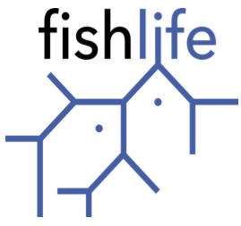

# FishLife 
Fish trait database and imputation

FishLife is an collaborative and international project that aims to:

1. Compile life-history traits (demographic parameters as well as behavioral, reproductive, morphological, and trophic traits)
2. Estimate trade-offs among traits while imputing missing values;
3. Distribute imputed trait-values (and standard errors) for use in fisheries science and management.

The FishLife R-package includes results from three prior analyses:

* The database and results described by [Thorson et al. (2023)](https://doi.org/10.1111/2041-210X.14076), introducing phylogenetic structural equation models and combining this with phylogenetic comparative methods to describe trade-offs among a larger set of life-history, morphometric, behavioral, trophic, and reproductive traits;
* The database and results described by [Thorson (2020)](https://doi.org/10.1111/faf.12427), applying phylogenetic factor analysis to the original database as well as RAM Legacy database records of stock-recruit relationships to estimate a full life-cycle model for all species;
* The original database and results described by [Thorson Munch Cope Gao (2017)](https://doi.org/10.1002/eap.1606), introducing phylogenetic factor analysis and using records of size, growth, maturity, and mortality parameters from FishBase as downloaded in 2016.

For each of these three analyses, the R-package _FishLife_ includes the compiled database of trait measurements (aim-1), the estimated covariance among traits (aim-2), and the imputed trait values (aim-3).  See package vignettes for more details.

Description of package
=============
### Please cite if using the software
* Thorson, J.T., Maureaud, A.A., Frelat, R., Mérigot, B., Bigman, J.S., Friedman, S.T., Palomares, M.L.D., Pinsky, M.L., Price, S.A., Wainwright, P., 2023. Identifying direct and indirect associations among traits by merging phylogenetic comparative methods and structural equation models. Methods Ecol. Evol. n/a. https://doi.org/10.1111/2041-210X.14076

### Previous software versions and analytical descriptions
* Thorson, J.T., 2020. Predicting recruitment density dependence and intrinsic growth rate for all fishes worldwide using a data-integrated life-history model. Fish Fish. 21, 237–251. https://doi.org/10.1111/faf.12427 
* Thorson, J. T., S. B. Munch, J. M. Cope, and J. Gao. 2017. Predicting life history parameters for all fishes worldwide. Ecological Applications. 27(8): 2262–2276. http://onlinelibrary.wiley.com/doi/10.1002/eap.1606/full

Further reading
=============
### Evaluating accuracy of data and life-history predictions in FishBase
* Thorson, J. T., J. M. Cope, and W. S. Patrick. 2014. Assessing the quality of life history information in publicly available databases. Ecological Applications 24:217–226. http://onlinelibrary.wiley.com/doi/10.1890/12-1855.1/abstract

### Simplified software for phylogenetic structural equation models
* Package [phylosem](https://james-thorson-noaa.github.io/phylosem/index.html) on CRAN
* Thorson, J. T., & van der Bijl, W. (2023). phylosem: A fast and simple R package for phylogenetic inference and trait imputation using phylogenetic structural equation models. Journal of Evolutionary Biology, 36(10), 1357–1364. https://doi.org/10.1111/jeb.14234

### Role for phylogenetic comparative methods in fisheries science
* Thorson, J. T. (2024). Trees for fishes: The neglected role for phylogenetic comparative methods in fisheries science. Fish and Fisheries, 25(1), 168–179. https://doi.org/10.1111/faf.12800

Description of research
=============
Presentation of research program available [online](https://www.youtube.com/watch?v=efVXe0J80oU&feature=youtu.be)

Applications for stock assessment
=============

* Sea mullet, east coast Australia, Fisheries Queensland 2022 (link [here](https://era.daf.qld.gov.au/id/eprint/8600/1/sea_mullet_rtex_2022.pdf))
* Spanish mackerel, eastern Australia, Fisheries Queensland 2021 (link [here](http://era.daf.qld.gov.au/id/eprint/8226/25/Spanish%20mackerel%20EC%20stock%20assessment%20report%202021.pdf))
* Uku, Hawaii, PIFSC, 2020 (link [here](https://www.researchgate.net/profile/Marc_Nadon/publication/341385433_Stock_assessment_of_uku_Aprion_virescens_in_Hawaii_2020/links/5ebd99bf92851c11a867bf18/Stock-assessment-of-uku-Aprion-virescens-in-Hawaii-2020.pdf))
* Pollock, Eastern Bering Sea, AFSC, 2018 (link [here](https://archive.fisheries.noaa.gov/afsc/REFM/docs/2018/BSAI/2018EBSpollock.pdf))
* Black Marlin, Indian Ocean, IOTC, 2018 (link [here](https://www.iotc.org/sites/default/files/documents/2018/09/IOTC-2018-WPB16-15_-_BLM_JABBA_Final.pdf))
* Striped Marlin, Indian Ocean, IOTC, 2018 (link [here](https://www.iotc.org/sites/default/files/documents/2018/09/IOTC-2018-WPB16-16_-_MLS_JABBA_Final.pdf))
* Smoothound shark, South Africa, DAFF, 2018 (link [here](https://www.researchgate.net/publication/338491221_Assessment_of_smoothhound_shark_Mustelus_mustelus_in_South_Africa))
* Soupfin shark, South Africa, DAFF, 2018 (link [here](https://www.researchgate.net/publication/338491033_First_comprehensive_assessment_of_soupfin_shark_Galeorhinus_galeus_in_South_Africa))
 * Yang, W.-H., Martin, T.S., Moffitt, D., 2022. Stock assessment of Queensland east coast dusky flathead (Platycephalus fuscus), Australia, with data to December 2020.
 * Parker, D., Kikuchi, E., Mourato, B.L., 2022. Assessment of the South Atlantic swordfish (Xiphias gladius) stock using JABBA. Collect Vol Sci Pap ICCAT 79, 608–639. (link [here](https://www.researchgate.net/profile/Bruno-Mourato/publication/365748009_ASSESSMENT_OF_THE_SOUTH_ATLANTIC_SWORDFISH_XIPHIAS_GLADIUS_STOCK_USING_JABBA/links/638142f1c2cb154d29293a78/ASSESSMENT-OF-THE-SOUTH-ATLANTIC-SWORDFISH-XIPHIAS-GLADIUS-STOCK-USING-JABBA.pdf))

Journal Arcticles using FishLife
=============
1.	Auber, A., Waldock, C., Maire, A., Goberville, E., Albouy, C., Algar, A.C., McLean, M., Brind’Amour, A., Green, A.L., Tupper, M., Vigliola, L., Kaschner, K., Kesner-Reyes, K., Beger, M., Tjiputra, J., Toussaint, A., Violle, C., Mouquet, N., Thuiller, W., Mouillot, D., 2022. A functional vulnerability framework for biodiversity conservation. Nat. Commun. 13, 4774. https://doi.org/10.1038/s41467-022-32331-y

2.	Fitz, K.S., Montes Jr., H.R., Thompson, D.M., Pinsky, M.L., n.d. Isolation-by-distance and isolation-by-oceanography in Maroon Anemonefish (Amphiprion biaculeatus). Evol. Appl. n/a. https://doi.org/10.1111/eva.13448

3.	Fujiwara, M., Simpson, A., Torres-Ceron, M., Martinez-Andrade, F., 2022. Life-history traits and temporal patterns in the incidence of coastal fishes experiencing tropicalization. Ecosphere 13, e4188. https://doi.org/10.1002/ecs2.4188

4.	Hay, A., Riggins, C.L., Heard, T., Garoutte, C., Rodriguez, Y., Fillipone, F., Smith, K.K., Menchaca, N., Williamson, J., Perkin, J.S., 2022. Movement and mortality of invasive suckermouth armored catfish during a spearfishing control experiment. Biol. Invasions. https://doi.org/10.1007/s10530-022-02834-2

5.	Hirota, D.S., Haimovici, M., Sant’Ana, R., Mourato, B.L., Santos, E.K., Cardoso, L.G., 2022. Life history, population dynamics and stock assessment of the bycatch species Brazilian flathead (Percophis brasiliensis) in southern Brazil. Reg. Stud. Mar. Sci. 102597. https://doi.org/10.1016/j.rsma.2022.102597

6.	Mora, P., Figueroa-Muñoz, G., Cubillos, L., Strange-Olate, P., 2022. A data-limited approach to determine the status of the artisanal fishery of sea silverside in southern Chile. Mar. Fish. Sci. MAFIS 35, 275–298.

7.	Omori, K.L., Tribuzio, C.G., Babcock, E.A., Hoenig, J.M., 2021. Methods for Identifying Species Complexes Using a Novel Suite of Multivariate Approaches and Multiple Data Sources: A Case Study With Gulf of Alaska Rockfish. Front. Mar. Sci. 1084.

8.	Pawluk, M., Fujiwara, M., Martinez-Andrade, F., 2022. Climate change linked to functional homogenization of a subtropical estuarine system. Ecol. Evol. 12, e8783. https://doi.org/10.1002/ece3.8783

9.	Pons, M., Cope, J.M., Kell, L.T., 2020. Comparing performance of catch-based and length-based stock assessment methods in data-limited fisheries. Can. J. Fish. Aquat. Sci. 77, 1026–1037. https://doi.org/10.1139/cjfas-2019-0276

10.	Rudd, M.B., Thorson, J.T., Sagarese, S.R., 2019. Ensemble models for data-poor assessment: accounting for uncertainty in life-history information. ICES J. Mar. Sci. 76, 870–883. https://doi.org/10.1093/icesjms/fsz012

11.	Safaraliev, I.A., Popov, N.N., 2022. Qualitative Assessment of the Stock Status of Freshwater Bream Abramis brama (Cyprinidae) from the Ural Stock Based on the LB-SPR Method. J. Ichthyol. 62, 476–486. https://doi.org/10.1134/S0032945222030134

12.	Thorson, J.T., 2020. Predicting recruitment density dependence and intrinsic growth rate for all fishes worldwide using a data-integrated life-history model. Fish Fish. 21, 237–251. https://doi.org/10.1111/faf.12427

13.	Thorson, J.T., Munch, S.B., Cope, J.M., Gao, J., 2017. Predicting life history parameters for all fishes worldwide. Ecol. Appl. 27, 2262–2276. https://doi.org/10.1002/eap.1606

# NOAA Enterprise GitHub disclaimer
This repository is a scientific product and is not official communication of the National Oceanic and Atmospheric Administration, or the United States Department of Commerce. All NOAA GitHub project code is provided on an ‘as is’ basis and the user assumes responsibility for its use. Any claims against the Department of Commerce or Department of Commerce bureaus stemming from the use of this GitHub project will be governed by all applicable Federal law. Any reference to specific commercial products, processes, or services by service mark, trademark, manufacturer, or otherwise, does not constitute or imply their endorsement, recommendation or favoring by the Department of Commerce. The Department of Commerce seal and logo, or the seal and logo of a DOC bureau, shall not be used in any manner to imply endorsement of any commercial product or activity by DOC or the United States Government.

